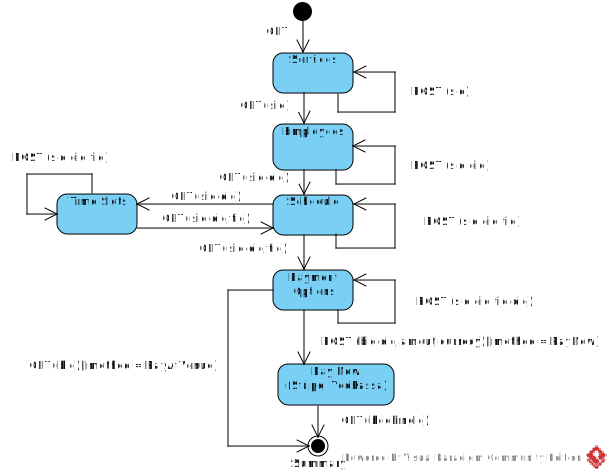
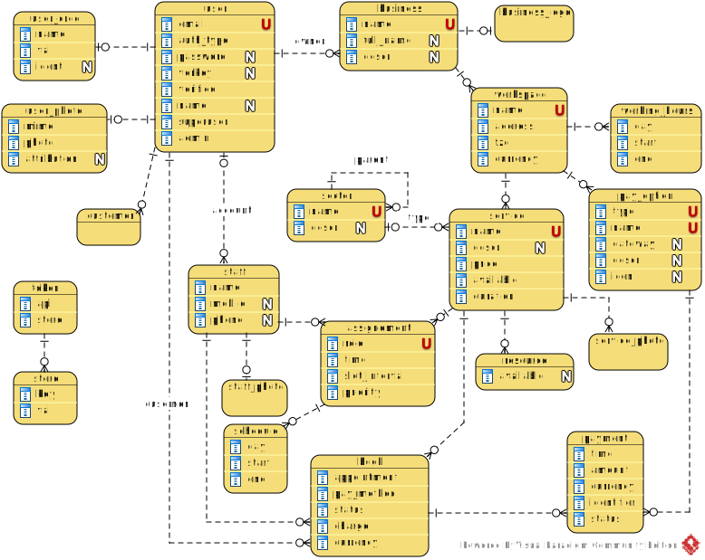

[In english](https://github.com/ciukstar/reservare/blob/master/README.md)

[În română](https://github.com/ciukstar/reservare/blob/master/README.ro.md)

[На русском](https://github.com/ciukstar/reservare/blob/master/README.ru.md)


# Reservare

Réservations en ligne de prestations et de rendez-vous

## Aperçu

[« Reservare »](https://reservarefr-i4rimw5qwq-de.a.run.app) permet aux entreprises d'enregistrer des services et des ressources pour lesquels un client peut réserver et/ou prendre rendez-vous.  

*Diagramme de cas d'utilisation*  


## Réserver une prestation
*Diagramme de machine d'état*  


## Prendre rendez-vous
*Diagramme de machine d'état*  


## Superutilisateur
* Nom d'utilisateur  
  ```$YESOD_SUPERUSER_USERNAME```
* Mot de passe  
  ```$YESOD_SUPERUSER_PASSWORD```

Un compte superutilisateur est défini au moment du déploiement. Le superutilisateur gère les autres utilisateurs et accorde ou révoque les privilèges d'administrateur à des utilisateurs spécifiques.

## Intégration avec des API externes

* E-mail: [Gmail API](https://developers.google.com/gmail/api/guides)

  * Identifiant client  
    ```$YESOD_GOOGLE_CLIENT_ID```
  * Secret client  
    ```$YESOD_GOOGLE_CLIENT_SECRET```

* Passerelle de paiement: [Stripe](https://stripe.com/)
  * Clé publique  
    ```$YESOD_STRIPE_PK```
  * Clé secrète  
    ```$YESOD_STRIPE_SK```
    
  Pour simuler un paiement réussi, utilisez les cartes de test de la [liste suivante](https://stripe.com/docs/testing?testing-method=card-numbers#cards).

  Pour simuler les paiements refusés par l'émetteur, utilisez les cartes de test de la [liste suivante](https://stripe.com/docs/testing?testing-method=card-numbers#declined-payments).

* Passerelle de paiement: [YooKassa](https://yookassa.ru/)
  * ID de la boutique  
    ```$YESOD_YOOKASSA_SHOP_ID```
  * Clé secrète  
    ```$YESOD_YOOKASSA_SECRET_KEY```

  Pour simuler un paiement réussi, utilisez les cartes de test de la [liste suivante](https://yookassa.ru/developers/payment-acceptance/testing-and-going-live/testing#test-bank-card-success).

  Pour simuler les paiements refusés par l'émetteur, utilisez les cartes de test de la [liste suivante](https://yookassa.ru/developers/payment-acceptance/testing-and-going-live/testing#test-bank-card-cancellation-details).

## Optimisation du moteur de recherche
* Google SEO  
  ```$YESOD_GOOGLE_SITE_VERIFICATION```
* Bing SEO  
  ```$YESOD_MS_VALIDATE```
* Yandex SEO  
  ```$YESOD_YANDEX_VERIFICATION```


## Entités de base

### Utilisateur
Un nouvel utilisateur peut [s'inscrire](https://reservarefr-i4rimw5qwq-de.a.run.app/auth/login) en utilisant un compte Google existant ou en utilisant une adresse e-mail vérifiée. [L'API Gmail](https://developers.google.com/gmail/api/guides) est utilisée comme intermédiaire pour envoyer des liens de vérification vers la boîte de réception de l'utilisateur.

Un utilisateur peut se voir attribuer le rôle d'administrateur par un superutilisateur ou par un autre administrateur. Seuls les utilisateurs disposant du rôle d'administrateur ont accès aux données administratives.


### Entreprise
...

### Espace de travail
...

### Modalité de paiement
Pour chaque espace de travail, vous pouvez spécifier une ou plusieurs options de paiement en sélectionnant son type, son nom et sa passerelle de paiement.

Si plusieurs passerelles de paiement sont configurées pour un espace de travail, elles seront présentées comme options à l'utilisateur qui réserve le rendez-vous.

Si un espace de travail n'a qu'une seule option de paiement (passerelle de paiement) configurée, elle sera alors utilisée par défaut et représentera ainsi une étape de moins dans le processus de réservation.

Au moins une option de paiement (passerelle de paiement) doit être spécifiée pour l'espace de travail. Si aucune option n'est spécifiée, une erreur se produira lors de la réservation.

### Service
...

### Personelle
...

### Affectation
...

### Horaire de travail
...

### Réservation
...


*Diagramme entité-relation*  


## Démo

[Cliquez ici pour voir la démo](https://reservarefr-i4rimw5qwq-de.a.run.app)

_* Cliquez sur le bouton [](https://reservarefr-i4rimw5qwq-de.a.run.app/auth/login) pour obtenir une liste des comptes d'utilisateurs de démonstration_
