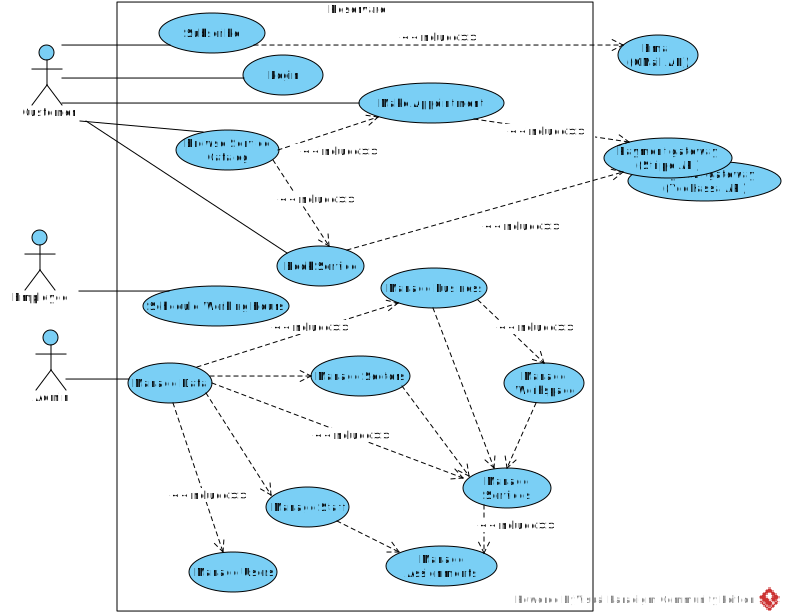
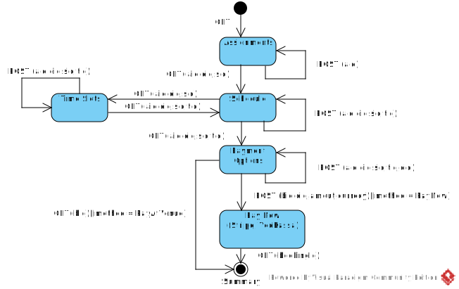

# Reservare

Appointment booking web app

## Overview

[“Reservare”](https://reservare-i4rimw5qwq-de.a.run.app) allows businesses to register services and resources that a customer can book and/or schedule an appointment for.  
*Use Case Diagram*  


## Book a service
*State Machine Diagram*  


## Make an appointment
*State Machine Diagram*  


## Integration with external APIs

* Email: [Gmail API](https://developers.google.com/gmail/api/guides)

  * Client id
    ```$YESOD_GOOGLE_CLIENT_ID```
  * Client secret
    ```$YESOD_GOOGLE_CLIENT_SECRET```

* Payment gateway: [Stripe](https://stripe.com/)
  ```
  ENV: YESOD_STRIPE_PK, YESOD_STRIPE_SK
  ```
  To simulate a successful payment, use test cards from the [following list](https://stripe.com/docs/testing?testing-method=card-numbers#cards).

  To simulate payments that the issuer declines, use test cards from the [following list](https://stripe.com/docs/testing?testing-method=card-numbers#declined-payments).


## Basic entities

### User
...

### Business
...

### Workspace
...

### Service
...

### Staff
...

### Assignement
...

### Schedule
...

### Booking
...


*Entity Relationship Diagram*  


## Demo

[Click here to see demo](https://reservare-i4rimw5qwq-de.a.run.app)

_* Click on the [](https://reservare-i4rimw5qwq-de.a.run.app/auth/login) button to get a list of demo accounts_
