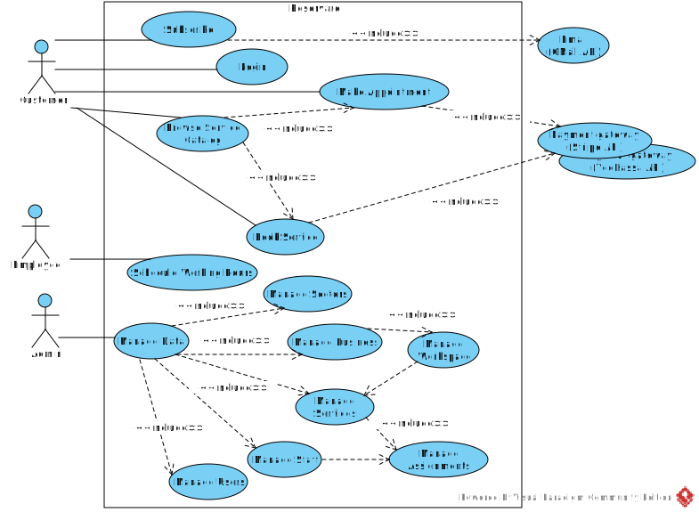
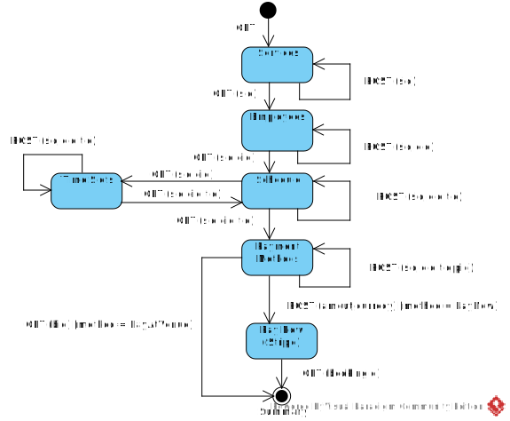
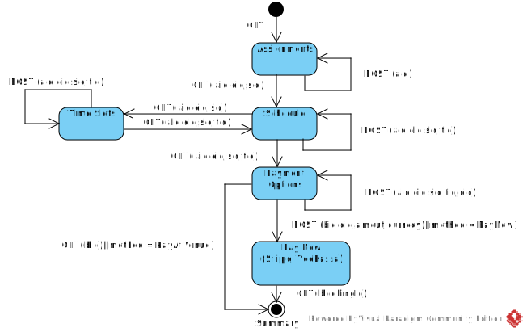
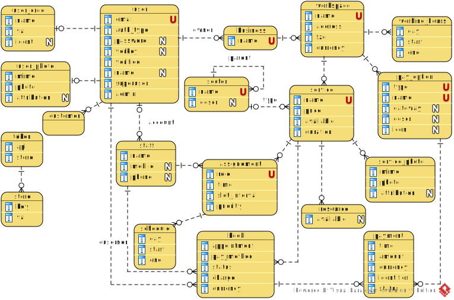

[In english](https://github.com/ciukstar/reservare/blob/master/README.md)

[En français](https://github.com/ciukstar/reservare/blob/master/README.fr.md)

[На русском](https://github.com/ciukstar/reservare/blob/master/README.ru.md)

# Reservare

Rezervări online pentru servicii și programări

## Prezentare generală 

[„Reservare”](https://reservarero-i4rimw5qwq-de.a.run.app) permite companiilor să înregistreze servicii și resurse pentru care un client le poate rezerva și/sau programa o întâlnire.  

*Diagrama cazurilor de utilizare*  


## Rezervați un serviciu
*Diagrama mașinii de stări*  


## Faceți o programare
*Diagrama mașinii de stări*  


## Superutilizator
* Nume de utilizator  
  ```$YESOD_SUPERUSER_USERNAME```
* Parola  
  ```$YESOD_SUPERUSER_PASSWORD```
  
Un cont de superutilizator este definit în momentul implementării. Superutilizatorul gestionează alți utilizatori și acordă sau revocă privilegii de administrator anumitor utilizatori.

## Integrare cu API-uri externe

* E-mail: [Gmail API](https://developers.google.com/gmail/api/guides)

  * Id-ul clientului  
    ```$YESOD_GOOGLE_CLIENT_ID```
  * Secretul clientului  
    ```$YESOD_GOOGLE_CLIENT_SECRET```

* Gateway de plată: [Stripe](https://stripe.com/)
  * Cheie publică  
    ```$YESOD_STRIPE_PK```
  * Cheie secretă  
    ```$YESOD_STRIPE_SK```
    
  Pentru a simula o plată reușită, utilizați carduri de test din [lista următoare](https://stripe.com/docs/testing?testing-method=card-numbers#cards).

  Pentru a simula plățile pe care emitentul le refuză, utilizați carduri de testare din [următoarea listă](https://stripe.com/docs/testing?testing-method=card-numbers#declined-payments).

* Gateway de plată: [YooKassa](https://yookassa.ru/)
  * ID magazin  
    ```$YESOD_YOOKASSA_SHOP_ID```
  * Cheie secretă  
    ```$YESOD_YOOKASSA_SECRET_KEY```

  Pentru a simula o plată reușită, utilizați carduri de test din [lista următoare](https://yookassa.ru/developers/payment-acceptance/testing-and-going-live/testing#test-bank-card-success).

  Pentru a simula plățile pe care emitentul le refuză, utilizați carduri de testare din [următoarea listă](https://yookassa.ru/developers/payment-acceptance/testing-and-going-live/testing#test-bank-card-cancellation-details).

## Optimizare motor de căutare
* Google SEO  
  ```$YESOD_GOOGLE_SITE_VERIFICATION```
* Bing SEO  
  ```$YESOD_MS_VALIDATE```
* Yandex SEO  
  ```$YESOD_YANDEX_VERIFICATION```

## Entități de bază

### Utilizator
Un utilizator nou se poate [înscrie](https://reservarero-i4rimw5qwq-de.a.run.app/auth/login) folosind un cont Google existent sau folosind o adresă de e-mail verificată. [API-ul Gmail](https://developers.google.com/gmail/api/guides) este folosit ca intermediar pentru a trimite linkuri de verificare către căsuța de e-mail a utilizatorului.

Un utilizator poate primi rolul de administrator de un superutilizator sau de un alt administrator. Numai utilizatorii cu rol de administrator au acces la datele administrative.

### Afacere
...

### Spațiu de lucru
...

### Opțiune de plată
...

### Serviciu
...

### Personal
...

### Atribuție
...

### Orarul de lucru
...

### Rezervare
...


*Diagrama relație-entitate*  


## Demo

[Click aici pentru a vedea demo](https://reservarero-i4rimw5qwq-de.a.run.app)

_* Faceți clic pe butonul [](https://reservarero-i4rimw5qwq-de.a.run.app/auth/login) pentru a obține o listă de conturi de utilizator demonstrative_
